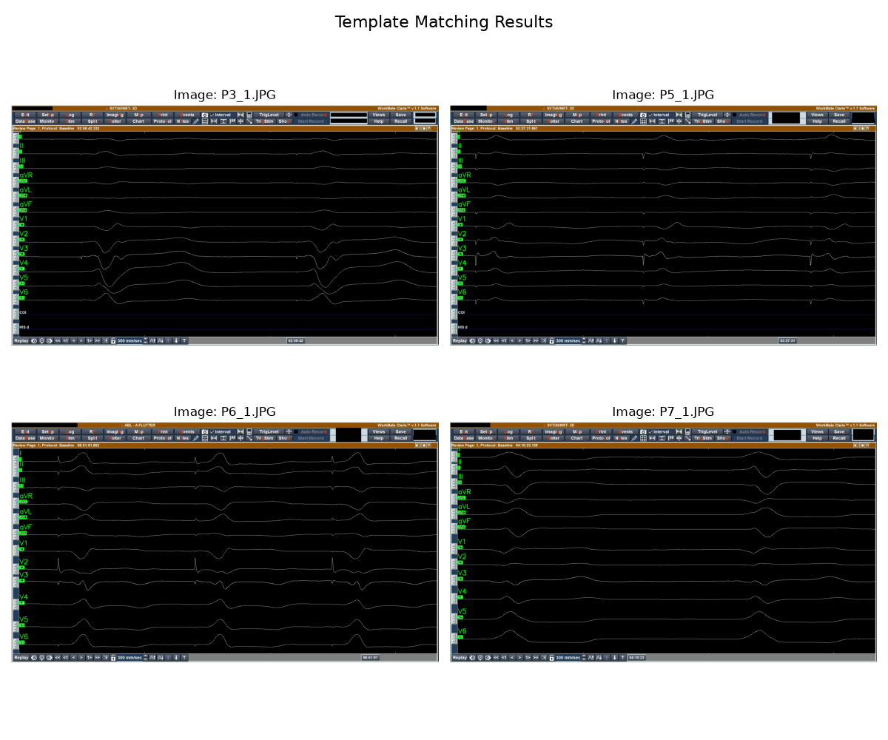

## Zawartość folderu `report/images`
aliasing.png                images_binary.png            P3_1_signal_functions.png  P7_1_signal_functions.png      templates-board.png
dummy_signal_functions.png  images_marked_templates.png  P5_1_signal_functions.png  template_board.png             wrong_templates.png
I_contour.png               images_removed_labels.png    P6_1_signal_functions.png  template_matching_results.png

# Ekstrakcja danych EKG ze zrzutu ekranu

# Wprowadzenie

Zadanie polega na ekstrakcji danych EKG ze zrzutu ekranu. Celem jest przekształcenie obrazu zawierającego wykres EKG w dane numeryczne. Na danym zrzucie są widoczne dane z 200ms, a oś Y jest podzielona na 12 kanałów (bez COI i HIS). Krok czasowy powinien wynosić 1ms, co oznacza, że dla 200ms powinno być 200 punktów danych dla każdego kanału.


# Układ kodu
- `main.py` - główny plik, który wykonuje wszystkie kroki ekstrakcji danych EKG 
- `src/plots.py` - funkcje do rysowania wykresów
- `src/types.py` - plike z przydatnymi strukturami 

# Uruchomienie

## Używając uv
```bash
uv venv
source .venv/bin/activate
uv sync
python main.py --input_dir images --output_dir output_csv
```

## Używając pip
```bash
python -m venv .venv
source .venv/bin/activate
pip install -r requirements.txt
python main.py --input_dir images --output_dir output_csv
```

# Metodologia

## 1. Wykrycie kanałów
Pierwszym krokiem jest wykrycie linii poziomych, które reprezentują kanały EKG. Ponieważ zdjęcia są statycznymi zrzutami ekranu, można użyć metody `template matching`. W tym celu został stworzony folder `templates`, który zawiera szablony labeli kanałów. Szablony te są używane do wykrywania pozycji kanałów na obrazie. za pomocą funkcji `cv2.matchTemplate`. Żeby uniknąć błędnego wykrywania, np. szablon `I` wykrywał się z prawej strony kanału `III`, wykrywanie szablonów odbywa się w kolejności od szablonów najbardziej dokładnych do mniej dokładnych. Po każdym wykryciu szablonu, pixele z obrazka, które odpowiadają wykrytemu szablonowi, są zamalowywane na czarno, aby nie były wykrywane w kolejnych iteracjach.

### Użyte szablony:


### Przykład __błędnego__ wykrywania szablonów:


### Wyniki wykrywania kanałów z usuwaniem wykrytych szablonów z obrazu w odpowiedniej kolejności:



## 2. Usunięcie kolorów oraz labali z obrazka.

Ponieważ będą wykrywane białe piksele jako krzywą funkcji, usuwamy białe labele z obrazka prostą różnicą obrazów za pomocą funkcji `cv2.subtract`


## 3. Binaryzacja obrazu
Ponieważ zrzut ekranu jest standardowy, do binaryzacji wystarczy proste progowanie. W tym celu użyto funkcji `cv2.threshold` z progiem 127. W wyniku binaryzacji powstaje obraz, na którym białe piksele odpowiadają krzywej funkcji, a czarne tło.


## 4. Ekstrakcja obszarów z wykresami

Żeby zmniejszyć obszar poszukiwania pikseli, które odpowiadają krzywej funkcji, wycinamy z obrazu obszary, które odpowiadają wykresom. W tym celu używamy wcześniej wykrytych labeli kanałów. Dla każdego z nich dodajemy duży margines wertykalny, ponieważ niektóre kanały mają duże amplitudy. Minusem jest to że niektóry kanały zawierają fragmenty innych wykresów, a nawet całe inne kanały.

Żeby zidentyfikować poprawny kanał Będziemy później używać odległości do labela 


## 5. Extrakcja lini za pomocą konturów
Na każdym z wyciętych obszarów szukamy konturów za pomocą funkcji `cv2.findContours`. Następnie filtrujemy znalezione kontury, aby znaleźć ten, który odpowiada krzywej funkcji. Pierwszym filtrem jest minimalna szerokość bounding boxa, która musi wynosić przynajmniej 80% szerokości całego obszaru. 

Z tak zflitrowanych konturów wybieramy ten, który jest najbliżej labela kanału. Odległość jest mierzona jako najmniejsza odległość między punktami konturu a labela kanału.

### Przykład znalezionego konturów:


## 6. Przekształcenie konturu w dane numeryczne
Po znalezieniu konturu, który odpowiada krzywej funkcji, przekształcamy go w dane numeryczne

1. Najpierw dla każdego zduplikowanego `x` obliczamy średnią `y`
2. Następnie jako baseline wybieramy medianę `y`
3. Obliczamy `pixels_per_ms` jako szerokość obszaru podzieloną przez 200ms
4. Tworzymy nową oś od 0 do 200ms z krokiem 1ms
5. Używamy `scipy.interpolate.interp1d` do interpolacji wartości `y` dla nowej osi `x`. Żeby uniknąć problemów z interpolacją, np. gdy funkcja ma gwałtowne zmiany, co jest częste w funkcjach EKG, używamy __interpolacji liniowej__.

Szczegóły znajdują się w funkcji `contour_to_signal_function()`

### Wyniki przekształconych funkcji


### Niedokładności
Szerokość obszaru to około 1920 pikseli, więc `pixels_per_ms` wynosi około 9.6. Oznacza to, że występuje __aliasing__, ponieważ funkcja EKG może mieć zmiany, które trwają krócej niż 9.6ms, a więc nie są odpowiednio próbkowane. W rezultacie niektóre funkcje mogą być niedokładne, szczególnie te z dużymi amplitudami i szybkim narastaniem.


## 7. Zapis danych do pliku CSV
Na koniec zapisujemy dane do pliku CSV, gdzie każda kolumna odpowiada jednemu kanałowi, a każdy wiersz odpowiada wartościom w danym czasie (od 0 do 200ms z krokiem 1ms).


